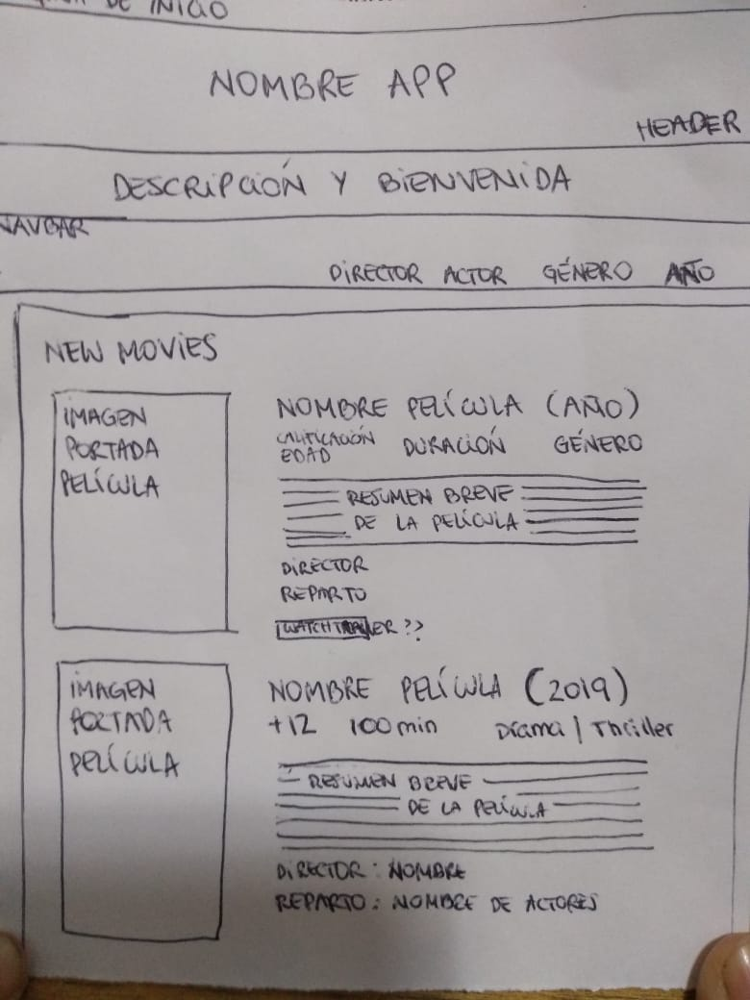
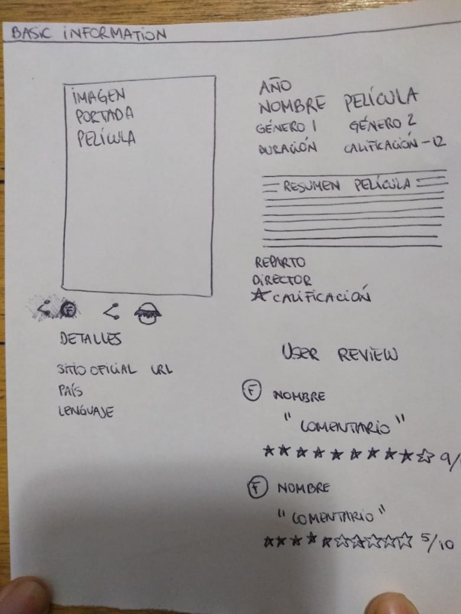
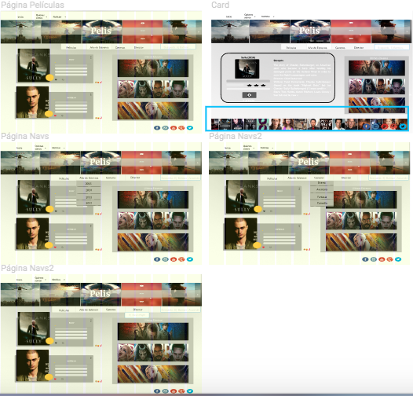
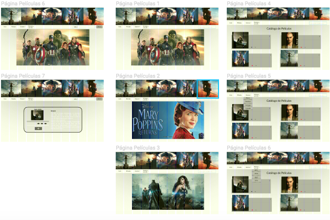
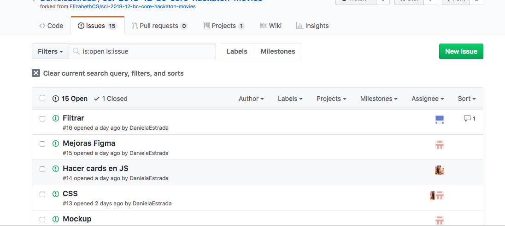
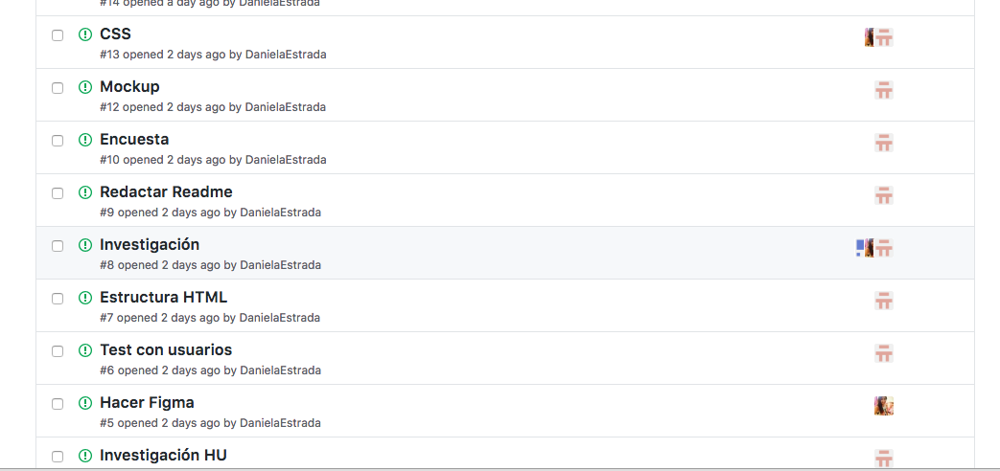
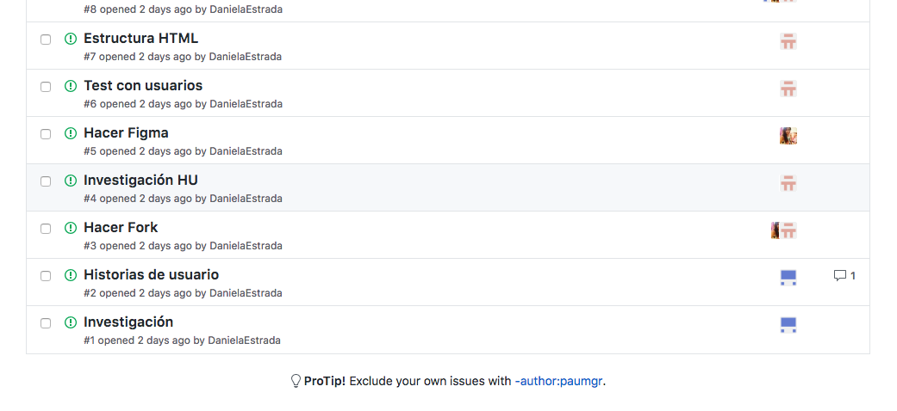

# "Hackathon" de final de Common Core, películas

# Ñamp

## Índice

* [Preámbulo](#preámbulo)
* [Resúmen del proyecto](#resúmen-del-proyecto)
* [Url Página web](#link)
* [Historias de usuarios](#historias-de-usuarios)
* [Modo de uso](#modo-de-uso)
* [Diseño de la Interfaz del usuario](#Consideraciones-para-el-diseño-de-la-interfaz-del-usuario)
* [Implementación de la Interfaz del usuario](#Implementación-de-la-Interfaz-del-usuario)
* [Consideraciones técnicas](#consideraciones-técnicas)
* [Planificación](#planificación)
* [Contenido de referencia](#contenido-de-referencia)
* [Resultado final](#resultado-final)

***

## Preámbulo

Con la aparición de plataformas para ver películas en la nube, como Netflix o Hulu, ver películas desde donde estés, comiendo lo que quieras (sin tener que pagar precios ridículos por pop-corn / pipoca / palomitas / canchita / cabritas), parando si es necesario, teniendo acceso a una cantidad abrumadora de películas... ha cambiado la experiencia del usuario y modificado el mercado de las películas a nivel global.

## Resúmen del proyecto

Plataforma de búqueda *rápida* con un base de datos en línea que almacena información relacionada con películas (incluyendo actores y directores) y sus respectivas calificaciones otorgadas por usuarios de [IMDb](https://www.imdb.com/)

## Esta página web es posible visualizarla en el siguiente link:

https://elizabethcg.github.io/scl-2018-12-bc-core-hackaton-movies/

## Historias de usuarios

###Usuario 1
Como espectador que vive lejos
Compartir la experiencia de ver una película en conjunto con otro/s.
Unir tiempo-espacio con seres queridos
Crear un ícono y mensaje tipo invitación con un texto + el horario de la película y los complementos considerados (chocolates, etc.)

###Usuario 2
Como posible espectador
Conocer más información acerca de una película específica.
Continuar el hilo de conversación de mis amigos que ayer vieron una película y yo no.
Agregar un input de búsqueda para filtar por nombre.

###Usuario 3
Como espectador.
Quiero ver el trailer de las películas.
Para tener una idea anticipada de si me gusta la película.

Evaluar si está disponible en la data.
Ver si es posible anexarlo…

###Usuario 4
Como Actor.
Quiero participar en un grupo de teatro.
Conocer directores y actores de cine.

Agregar un input de búsqueda para filtar por nombre.

###Usuario 5
Como espectador
Quiero filtrar las películas según clasificaciones de mi mayor interés: por género, por actor, por director, por puntuación.
Para revisar las películas de mi especial interés y agilizar y simplificar mi búsqueda.

Mostrar varios filtros distintos.
Realizar una búsqueda considerando más de un filtro.
Desplegar la información.
Acoplar con el resto de funcionalidades. (requerimiento 5)

###Usuario 6
Como espectador
Quiero ver la películas con mejor puntuación.
Quiero tomar una decisión segura y no perder tiempo en una película aburrida.

Contar con la visualización de la evaluación (estrellas).
Realizar un cálculo con resultado de porcentaje de críticas positivas v/s negativas.

###Usuario 7
Como vendedor de merchandising.
Quiero obtener información de las películas mejor evaluadas.
Para determinar los productos que estarán a la venta.

Contar con la visualización de de evaluación (estrellas).
Realizar un cálculo con resultado de porcentaje de críticas positivas v/s negativas.

###Usuario 8
Como novio
Quiero seleccionar una película romántica con mi novia.
Para compartir un momento de complicidad.

Filtro por género de película.
Permite seleccionar el género (romance).
Muestra el listado de películas.
Permite selecciona película.
Muestra información de la película.
Botón/ícono de comida sugerida.
Botón/ícono de souveniers sugeridos…

###Usuario 9
Como espectador.
Quiero tener sugerencias de experiencias de películas, comida y temas.
Para preparme y generar un momento completo con mis amigos.

Anexar al catálogo completo.
Evaluar si es posible llegar a esta implementación.

###Usuario 10
Como espectador.
Quiero seleccionar una película desde el catálogo.
Para ver un resumen de la trama.

Al seleccionar …. Se verá la información detallada de la película indicar que se selecciona…
Actores
Personajes
Imágenes
etc
Agregar todos los demás muestra…

## Modo de uso

### Menú del sitio

 La manera más fácil de buscar datos es seleccionando una de las alternativas presentadas en el navbar ubicado en la parte superior de la página. Y también existe un input de búsqueda para escribir y buscar por nombre de película, director o actor.

## Consideraciones para el diseño de la interfaz del usuario

Esta página contiene [un título] y [una explicación de que es un “buscador de películas”].
Barra con opciones de búsqueda.
Visualización de las Películas.

Se realiza una encuesta entre 25 personas. 

Una vez creado el diseño se realiza el primer testeo.

#### Prototipo de baja fidelidad

#### Testeos de usabilidad

Se realiza pruebas con 4 usuarios, quienes deben realizar las siguientes tareas: Buscar una película y un actor y/o director. Regresa a la página de inicio. Acceder por género.

Usuario1: Opina que la página de inicio podría ser más simple.
Entonces, realizamos cambios como: Página de inicio simple y dividida en un header, navbar de búsqueda y gran imagen relacionada con los últimos estrenos.

Usuario2: Le gustaría obtener más información como por ejemplo "datos freaks"
Entonces, realizamos mejoras como: Agregar link(url) en el footer.

Todos los usuarios: Les gustaría ver el trailer de la película que han seleccionado.
Entonces, realizamos mejoras como: Agregar link(url) en cada tarjeta.

#### Prototipo de alta fidelidad

Y continuamos construyendo la página web con una identidad gráfica, diseñada a partir de los resultados de la encuesta realizada y el primero testeo de usabilidad del prototipo de baja fidelidad, para ser utilizada en la interfaz.

[Figma]
https://www.figma.com/file/BFs32saK9EtpmhWj53s8ZS2e/Pelis2

Primer formato de figma antes de testear.

Figma definitivo despúes del testear.

## Implementación de la Interfaz de Usuario (HTML/CSS/JS)

1. Muestra la data en una interfaz: puede ser un card, una tabla, una lista, etc.
2. Permite al usuario filtrar la data.
3. Calcula estadísticas de las calificaciones otorgadas por los usuarios.
4. Se puede visualizar sin problemas desde distintos tamaños de pantallas: móviles,
   tablets y desktops.

## Consideraciones técnicas

La lógica del proyecto está implementada completamente en JavaScript(ES6), HTML y CSS.   

## Resúmen del código

El código creado en JavaScript(ES6) es una fórmula que permite visualizar la data, filtrarla, y realizar cálculos específicos como el promedio de calificaciones otorgadas por los usuarios, el máximo y/o el mínimo, que permiten mostrar información aún más relevante a otros usuarios.

## Pruebas unitarias

Pruebas unitarias para las funciones encargadas de _procesar_ y _filtrar_ la data, así como _calcular_ estadísticas.

## Planificación

## Contenido de referencia

(http://www.imdb.com/)

## Resultado final

